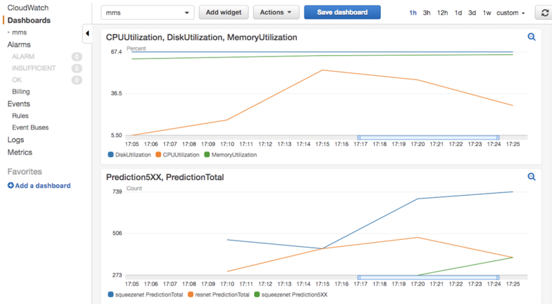

# Metrics on Model Server

## Contents of this Document
* [Basic Logging](#basic-logging)
* [CloudWatch Metrics](#cloudwatch-metrics)

MMS has built-in basic logging as well as integration with the AWS CloudWatch API for metrics and dashboards.

The default behavior of `mxnet-model-server` is to generate local log files, in the current working directory.

## Basic Logging
There are four arguments for MMS that facilitate logging of the model serving and inference activity.

1. **log-file**: optional, log file name. By default it is "mms_app.log". You may also specify a path and a custom file name such as `logs/squeezenet_inference`. This is the root file name that is used in file rotation.

    Usage example to create logs in a `logs` folder and name them `squeezenet_inference`:

    ```bash
    mkdir logs
    mxnet-model-server --models squeezenet=squeezenet_v1.1.model --log-file=logs/squeezenet_inference
    ```

1. **log-rotation-time**: optional, log rotation time. By default it is "1 H", which means one Hour. Valid format is "interval when", where _when_ can be "S", "M", "H", or "D". For a particular weekday use only "W0" - "W6". For midnight use only "midnight". When a file is rotated a timestamp is appended, for example, `squeezenet_inference` would look like `squeezenet_inference.2017-11-27_17-26` after log rotation. Check the [Python docs on logging handlers](https://docs.python.org/2/library/logging.handlers.html#logging.handlers.TimedRotatingFileHandler) for detailed information on values.

1. **log-level**: optional, log level. By default it is INFO. Possible values are NOTEST, DEBUG, INFO, ERROR and CRITICAL. Check the [Python docs for logging levels](https://docs.python.org/2/library/logging.html#logging-levels) for more information.

1. **metrics-write-to**: optional, metrics output destination. Can be `csv` or `cloudwatch`. By default, various metrics are collected and written to the default log file.

    If the `csv` value is passed to this argument, the metrics are recorded every minute in separate CSV files in a metrics folder in the current directory as follows.

    a) **mms_cpu.csv** - CPU load

    b) **mms_errors.csv** - number of errors

    c) **mms_memory.csv** - memory utilization

    d) **mms_preprocess_latency.csv** - any custom pre-processing latency

    e) **mms_disk.csv** - disk utilization

    f) **mms_inference_latency.csv** - any inference latency

    g) **mms_overall_latency.csv** - collective latency

    h) **mms_requests.csv** - number of inference requests

    If the `cloudwatch` value is passed, the above metrics will write to [AWS CloudWatch Service](https://aws.amazon.com/cloudwatch/). For information on configuration and setup is provided in the [CloudWatch Metrics](#cloudwatch-metrics) section.


## CloudWatch Metrics

AWS CloudWatch metrics enables a web-based dashboard where engineers can monitor a service status in real time. Engineers can also create triggers to alert when certain thresholds are exceeded, enabling an effective and fast response to issues in production. MMS has implemented the CloudWatch API so that metrics that are collected can be automatically delivered to a CloudWatch dashboard.


*Figure 1: Example CloudWatch dashboard with MMS metrics*

For more information on CloudWatch:
* [CloudWatch API Reference](http://docs.aws.amazon.com/AmazonCloudWatch/latest/APIReference/)
* [CloudWatch User Guide](http://docs.aws.amazon.com/AmazonCloudWatch/latest/monitoring/)

### Setup CloudWatch with MMS

Using the CloudWatch API feature in MMS requires you to have already [configured your AWS credentials](https://docs.aws.amazon.com/cli/latest/userguide/cli-config-files.html).

Once the credentials are setup MMS will be able to send the metrics to your CloudWatch dashboard.

### Usage Example

```bash
mxnet-model-server --models squeezenet=squeezenet_v1.1.model --metrics-write-to=cloudwatch
```

This will write metrics to CloudWatch every minute with namespace 'mxnet-model-server'.

**Note**: If you are not setup properly for the CloudWatch API, MMS will provide a warning only when the server starts. Example warning:

```bash
UserWarning: Failed to connect to AWS CloudWatch, metrics will be written to log.

Failure reason: You must specify a region.
```

### Supported MMS Metrics
|	metric name	|	dimension	|	unit	|	semantics	|
|---|---|---|---|
|	APIDescriptionTotal	|	host	|	count	|	total number of requests	|
|	CPUUtilization	|	host	|	percentage	|	cpu utillization on host	|
|	DiskAvailable	|	host	|	GB	|	disk available on host	|
|	DiskUsed	|	host	|	GB	|	disk used on host	|
|	DiskUtilization	|	host	|	percentage	|	disk used on host	|
|	LatencyInference	|	host, model	|	ms (stats)	|	inference time	|
|	LatencyOverall	|	host, model	|	ms (stats)	|	total time including inference, pre-, post-processing	|
|	LatencyPreprocess	|	host, model	|	ms (stats)	|	preprocessing time	|
|	MemoryAvailable	|	host	|	MB	|	memory available on host	|
|	MemoryUsed	|	host	|	MB	|	memory used on host	|
|	MemoryUtilization	|	host	|	percentage	|	memory used on host	|
|	PingTotal	|	host	|	count	|	total number of requests	|
|	Predict4XX	|	host, model	|	count	|	number of 5XX errors	|
|	Predict5XX	|	host, model	|	count	|	number of 4XX errors	|
|	PredictTotal	|	host, model	|	count	|	total number of requests (incl. errors)	|
