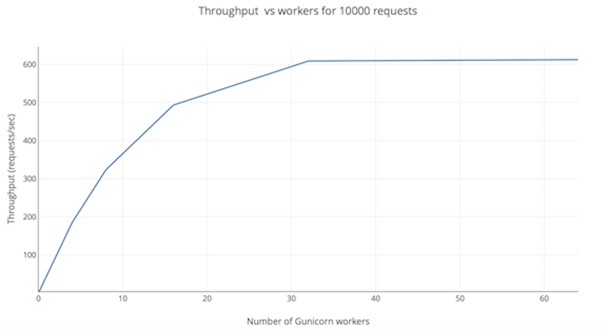
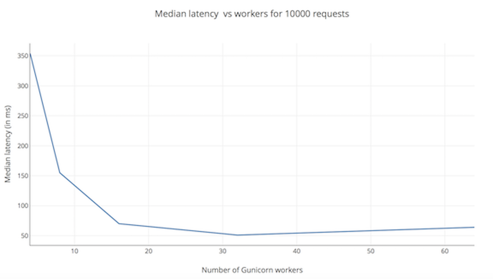
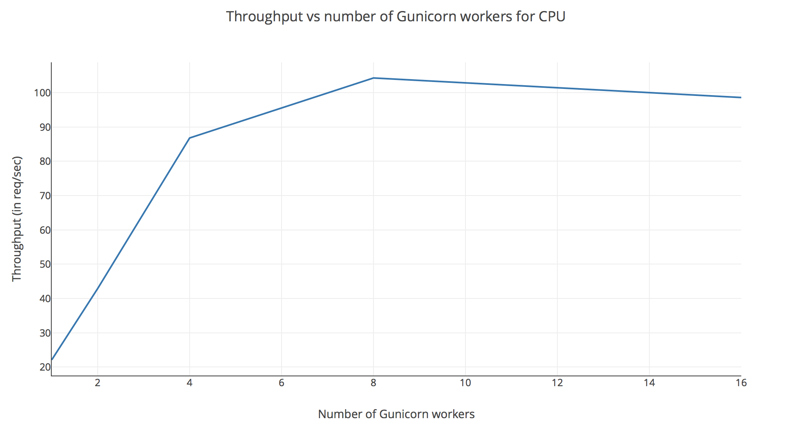
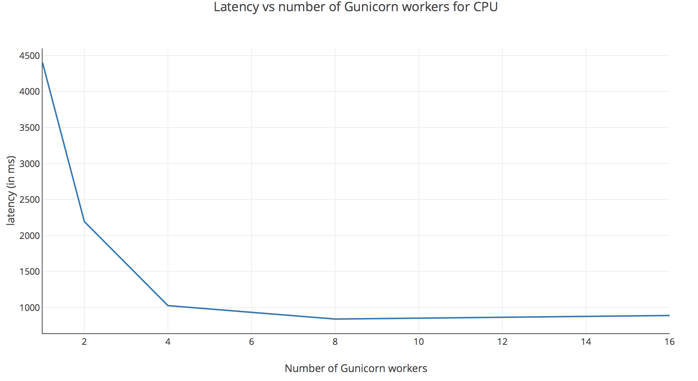

# Optimized configuration for EC2 instances for MMS in containers

A series of experiments were performed to come up with optimized configurations for AWS EC2 instances for both GPU and CPU instance types. Based on these experiments, the optimal configuration is as follows:

**The number of Gunicorn workers should be equal to the number of vCPUs in the EC2 instance.**

Details on the experiments with the c5.2xlarge (CPU instance) and p3.8xlarge (GPU instance) are described in the following sections.

## Experiment details

The optimal configurations were identified after performing experiments for CPU and GPU instances to study metrics like throughput and latencies when the server receives concurrent requests. The experiment details are as discussed below.

| Server tested | MXNet Model Server v0.3 |
| --- | --- |
| MXNet GPU build | mxnet-cu90mkl 1.1.0b20180215 (with MKL) |
| MXNet CPU build | mxnet-mkl 1.1.0b20180215 (with MKL) |
| Model | [Resnet-18](https://s3.amazonaws.com/model-server/models/resnet-18/resnet-18.model)
| Input-type to model | Image/JPG (RGB image of 3 X 224 X 224) |
| Input image | [test.jpg](github.com/awslabs/mxnet-model-server/blob/master/load-test/test.jpg)
| EC2 GPU Instance | p3.8xlarge (4 GPUs, 32 vCPUs) |
| EC2 CPU Instance | c5.2xlarge (8 CPUs) |
| GPU image used | [MMS GPU Docker image](https://hub.docker.com/r/awsdeeplearningteam/mms_gpu/) |
| CPU image used | [MMS CPU Docker image](https://hub.docker.com/r/awsdeeplearningteam/mms_cpu/) |

Various numbers of `concurrent workers` (`C`), sending `requests` (`R`), making a total (`R*C`) `requests` were sent to each server type. The parameters mentioned below were varied and the results are presented in the following respective sections.

## Number of Gunicorn workers (workers)
**The number of Gunicorn workers should be equal to the number of vCPUs in the EC2 instance.**

The experiments included varying the number of Gunicorn workers and studying throughput and latencies for both GPU (p3.8xlarge) and CPU (c5.2xlarge) instances. The plots below show how these metrics vary with number of workers.

* **Experiments on a GPU instance (p3.8xlarge with 32 vCPUs and 4 GPUs)**

The plots below show how throughput and median latency varied for 100 requests from 100 concurrent workers with number of Gunicorn workers on p3.8xlarge instance.

You can see that the throughput becomes constant after 32 workers while latency increases a bit, suggesting 32 workers to be optimal for the instance.

* **Experiments on a CPU instance (c5.2xlarge with 8 vCPUs)**

Similar experiments were performed on a CPU instance (100 requests from 100 concurrent workers), with following results for latency and throughput. Again, the number of Gunicorn workers was varied.

The CPU instance results are as shown in the above plots. The throughput is highest when there are 8 workers, which equals number of vCPUs in c5.2xlarge. As with the GPU instance type, it is recommended to set the number of Gunicorn workers equal to number of vCPUs present in a CPU instance.

**Note:**  The higher latencies seen during the load tests on CPU instance were because the c5.2xlarge CPU instance has 1/4th the total number of vCPUs as compared to the p3.8xlarge GPU instance. Both were serving the same number of incoming request. Apart from that, the GPU also shares some workload of CPUs, thereby reducing the request backlogs. Significantly lower latencies were seen when the rate of requests coming into c5.2xlarge instance were reduced by 1/4th.

The configuration settings published in [mms_app_gpu.conf](../docker/mms_app_gpu.conf) and [mms_app_cpu.conf](../docker/mms_app_cpu.conf) are based on these experiments, and optimized for the EC2 instances tested. You may need to change the number of workers in [mms_app_gpu.conf](../docker/mms_app_gpu.conf)/ [mms_app_cpu.conf](../docker/mms_app_cpu.conf) based on the GPU/CPU you use. Also, the performance may vary based on the model used.

## Number of GPUs (num-gpu)

The best performances are obtained using all the available GPUs available on the system. Experiments demonstrate that GPUs linearly scale throughput. By default, MMS identifies number of available GPUs and assigns the context of Gunicorn worker threads to each of them in round robin fashion. However, you can configure the number of GPUs in  you want to use in the [mms_app_gpu.conf](../docker/mms_app_gpu.conf) to use only few of the available instances.

## Performance on high loads

After setting number of workers and GPUs as described above, further experiments were run to understand scale of requests that MMS can handle. The containerized GPU version of MMS had a throughput of 650 requests/second without any error, despite being bombarded by requests from 600 concurrent workers, sending 100 requests each.
