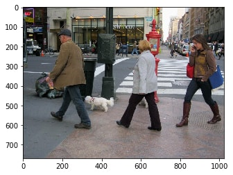

# Single Shot Multi Object Detection Inference Service

In this example, we show how to use a pretrained Single Shot Multi Object Detection (SSD) MXNet model for performing real time inference using Deep Model Server.

The pretrained model is trained on the [Pascal VOC 2012 dataset](http://host.robots.ox.ac.uk/pascal/VOC/voc2012/index.html) The network is a SSD model built on Resnet50 as base network to extract image features. The model is trained to detect the following entities (classes): ['aeroplane', 'bicycle', 'bird', 'boat', 'bottle', 'bus', 'car', 'cat', 'chair', 'cow', 'diningtable', 'dog', 'horse', 'motorbike', 'person', 'pottedplant', 'sheep', 'sofa', 'train', 'tvmonitor'].

The inference service would return the response in the format - '[(object_class, xmin, ymin, xmax, ymax)]. Where, xmin, ymin, xmax and ymax are the bounding box coordinates of the detected object.

# Objective

1. How to export and use a pre-trained MXNet model in Deep Model Server?
2. How to extend Deep Model Server with custom pre-processing and post-processing?

## Step 1 - Download the pre-trained SSD Model

```bash
 wget https://s3.amazonaws.com/mms-models/examples/resnet50_ssd/resnet50_ssd_model-symbol.json
 wget https://s3.amazonaws.com/mms-models/examples/resnet50_ssd/resnet50_ssd_model-0000.params
```

**Note** params file is around 125 MB.

## Step 2 - Prepare the signature file for Deep Model Server (DMS)

Define Input and Output name, type and shape in `signature.json` file.

In the pre-trained model, input name is 'data' and shape is '(1,3,512,512)'. Where, the expected input is a color image (3 channels - RGB) of shape 512*512. We also specify 'image/jpeg' as the expected input type.

Similarly, in the pre-trained model, output name is 'detection_output' with shape '(1,6132,6)' from the last layer of the network.

See signature.json file for more details.

## Step 3 - Prepare synset.txt with list of class names

`synset.txt` is a file where we define list of all classes detected by the model. The pre-trained SSD model used in the example is trained to detect 20 classes - person, car, aeroplane, bicycle and more. See synset.txt file for list of all classes.

The list of classes in synset.txt will be loaded by DMS as list of labels in inference logic.

## Step 4 - Extend DMS with custom preprocess and postprocess

DMS allows users to extend the base service functionality and add more custom initialization, pre-processing, inference and post-processing.

In this example, we only add custom pre-processing and post-processing steps. See `ssd_service.py` for more details on how to extend the base service and add custom pre-processing and post-processing.

## Step 5 - Export the model with deep-model-export CLI utility

In this step, we package, pre-trained MXNet Model we downloaded in Step 1, 'signature.json' file we prepared in step 2 and 'synset.txt' file we prepared in step 3 as one single 'resnet50_ssd_model.model' file. We use 'deep-model-export' command line utility (CLI) provided by DMS.

This tool prepares a .model file that will be provided as input to start the inference server.

```bash
deep-model-export --model-name resnet50_ssd_model --model-path .
```

## Step 6 - Start the Inference Service

Start the inference service by providing the 'resnet50_ssd_model.model' file we exported in Step 5. We also provide the custom extended service module, 'ssd_service.py'.

DMS then extracts the resources (signature, synset, model symbol and params) we have packaged into .model file and uses the extended custom service, to start the inference server.

By default, the server is started on the localhost at port 8080. You can optionally specify different host and/or port to start the server using the command line options - '--host ', '--port '.

```bash
 deep-model-server --models SSD=resnet50_ssd_model.model --service ssd_service.py
```

You should be able to see the output similar to the below output.

```
I1025 08:22:13 5986 /usr/local/lib/python2.7/dist-packages/dms/mxnet_model_server.py:__init__:75] Initialized model serving.
I1025 08:22:14 5986 /usr/local/lib/python2.7/dist-packages/dms/serving_frontend.py:add_endpoint:176] Adding endpoint: SSD_predict to Flask
I1025 08:22:14 5986 /usr/local/lib/python2.7/dist-packages/dms/serving_frontend.py:add_endpoint:176] Adding endpoint: ping to Flask
I1025 08:22:14 5986 /usr/local/lib/python2.7/dist-packages/dms/serving_frontend.py:add_endpoint:176] Adding endpoint: apiDescription to Flask
I1025 08:22:14 5986 /usr/local/lib/python2.7/dist-packages/dms/mxnet_model_server.py:start_model_serving:88] Service started at 127.0.0.1:8080
```
Awesome! we have successfully exported a pre-trained MXNet model, extended DMS with custom preprocess/postprocess and started a inference service.

## Step 7 - Test sample inference

Let us try the inference server we just started. Open another terminal on the same host. Download a sample image.

```bash
wget https://www.dphotographer.co.uk/users/21963/thm1024/1337890426_Img_8133.jpg
```

Use curl to make a prediction call by passing the downloaded image as input to the prediction request.

```bash
 curl -X POST http://127.0.0.1:8080/SSD/predict -F "input0=@1337890426_Img_8133.jpg"
```

You can expect the response similar to below. The output format is `[(object_class, xmin, ymin, xmax, ymax)]`.
Where, xmin, ymin, xmax and ymax are the bounding box coordinates of the detected object.

```
{
"prediction": [
  [
    "person",
    494,
    153,
    702,
    630
  ],
  [
    "person",
    108,
    108,
    351,
    591
  ],
  [
    "dog",
    306,
    446,
    468,
    530
  ],
  [
    "car",
    9,
    166,
    96,
    245
  ],
  [
    "person",
    826,
    127,
    1008,
    601
  ],
  [
    "person",
    480,
    177,
    511,
    253
  ],
  [
    "person",
    555,
    175,
    581,
    242
  ],
  [
    "person",
    514,
    177,
    547,
    250
  ],
  [
    "person",
    62,
    334,
    185,
    467
  ]
]
}
```

A consumer application can use this response to identify the objects in the input image and their bounding boxes.

For better visualization on the input and how we can use the inference output, see below:

Input Image



Output Image


# References
1. Adapted code and pre-trained model from - https://github.com/apache/incubator-mxnet/tree/master/example/ssd
2. Learn more about SSD in this tutorial - http://gluon.mxnet.io/chapter08_computer-vision/object-detection.html
