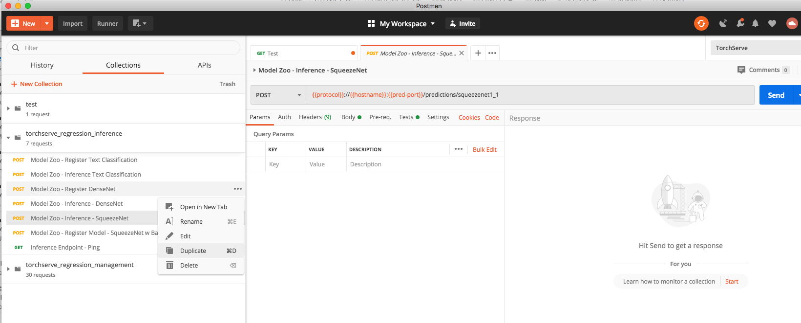

# MMS Regression Tests

This folder contains regression tests executed against MMS master.These tests use [POSTMAN](https://www.postman.com/downloads/) for exercising all the Management & Inference APIs.

### Running the test manually.

Pull multi-model-server pre build docker image
```
docker pull awsdeeplearningteam/multi-model-server
```

This would build a docker Image with a awsdeeplearningteam/multi-model-server:latest in which we would run our Regression Tests.

```
docker run -it --user root  awsdeeplearningteam/multi-model-server:latest /bin/bash
```

In the Docker CLI execute the following cmds.

```
apt-get update 
apt-get install -y git wget sudo 
git clone https://github.com/awslabs/multi-model-server.git
cd multi-model-server
```
To execute tests on master run: 

`./test/regression_tests.sh `

To execute tests on different run: 

`./test/regression_tests.sh <branch_name>`


You can view the logs for Test execution & the Multi-model-server in the /tmp dir.

```
cat /tmp/test_exec.log
cat /tmp/mms.log 
```

### Adding tests

To add to the tests, import a collection (in /postman) to Postman and add new requests.
Specifically to test for inference against a new model
* Open /postman/inference_data.json
* Add new json object with the new model url and payload.



Afterwards, export the collection as a v2.1 collection and replace the existing exported collection.
To add a new suite of tests, add a new collection to /postman and update regression_tests.sh to run the new collection and buldsepc.yml to keep track of the report.
